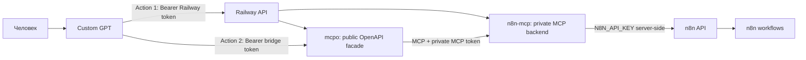

# ChatGPT как пульт-управления n8n

Единая инструкция. Читать этот файл как главный сценарий настройки. Старые вспомогательные файлы в репозитории — справка, но пользователю достаточно идти по этому README.

## 1. Целевая архитектура



Главное правило: `N8N_API_KEY` никогда не вставляется в GPT Actions. GPT Action для `mcpo` получает только отдельный bridge token.

## 2. Upstream-источники

| Компонент | Откуда брать | Назначение |
|---|---|---|
| `n8n-mcp` | `https://github.com/czlonkowski/n8n-mcp` | MCP backend для n8n docs, validation, workflow management |
| n8n-mcp Railway template | `https://railway.com/deploy/n8n-mcp` | быстрый deploy на Railway |
| Docker image n8n-mcp | `ghcr.io/czlonkowski/n8n-mcp-railway:latest` или `ghcr.io/czlonkowski/n8n-mcp:latest` | образ сервиса; в production лучше фиксировать version tag |
| `mcpo` | `https://github.com/open-webui/mcpo` | MCP → OpenAPI/REST proxy для GPT Actions |
| Docker image mcpo | `ghcr.io/open-webui/mcpo:main` | образ публичного фасада |
| Railway variables | `https://docs.railway.com/variables` | где указывать env/secrets |
| GPT Actions auth | `https://developers.openai.com/api/docs/actions/authentication` | где выбрать API Key / Bearer |

## 3. Ключи: что где создаётся и куда вставляется

| Ключ | Где создаётся | Куда вставлять | Кто использует |
|---|---|---|---|
| Railway API token | Railway → Account Settings → Tokens | GPT Action для Railway | GPT читает/создаёт Railway projects/services/env |
| Bridge token / `MCPO_API_KEY` | генерируем сами, например `openssl rand -base64 32` | Railway Variables у `mcpo` и GPT Action для `mcpo` | GPT вызывает публичный `mcpo` |
| Private MCP token / `AUTH_TOKEN` | генерируем сами | Railway Variables у `n8n-mcp`; также у `mcpo` как `N8N_MCP_AUTH_TOKEN` | `mcpo` вызывает приватный `n8n-mcp` |
| n8n API key / `N8N_API_KEY` | n8n UI → Settings → n8n API → Create API Key | только Railway Variables у `n8n-mcp` | `n8n-mcp` вызывает n8n API |

Запреты: не писать значения ключей в README, transcript, chat, screenshots. Не вставлять `N8N_API_KEY` в GPT Actions.

## 4. Railway service: `n8n-mcp`

Где переменные:

```text
Railway → Project → service n8n-mcp → Variables
```

Минимальные variables:

```env
AUTH_TOKEN=<private_mcp_token>
MCP_MODE=http
USE_FIXED_HTTP=true
NODE_ENV=production
LOG_LEVEL=info
TRUST_PROXY=1
CORS_ORIGIN=*
HOST=0.0.0.0
N8N_API_URL=https://<your-n8n-domain>
N8N_API_KEY=<masked>
```

Нюансы:

- В некоторых сборках вместо/рядом с `AUTH_TOKEN` встречается `MCP_AUTH_TOKEN`. Если есть оба имени, ставить одинаковое значение.
- `AUTH_TOKEN` защищает `n8n-mcp`; это не n8n API key.
- `N8N_API_KEY` берётся только в n8n UI и остаётся только server-side в Railway.

## 5. Railway service: `mcpo`

Где переменные:

```text
Railway → Project → service mcpo → Variables
```

Variables:

```env
MCPO_API_KEY=<bridge_token>
N8N_MCP_URL=https://<n8n-mcp-service-domain>/mcp
N8N_MCP_AUTH_TOKEN=<same_as_n8n_mcp_AUTH_TOKEN>
NODE_ENV=production
```

Команда запуска `mcpo` для HTTP/streamable MCP endpoint:

```bash
uvx mcpo \
  --host 0.0.0.0 \
  --port ${PORT:-8000} \
  --api-key "$MCPO_API_KEY" \
  --server-type streamable-http \
  --header "{\"Authorization\":\"Bearer $N8N_MCP_AUTH_TOKEN\"}" \
  -- "$N8N_MCP_URL"
```

Docker-вариант:

```bash
docker run -p 8000:8000 ghcr.io/open-webui/mcpo:main \
  --api-key "top-secret" \
  --server-type streamable-http \
  --header '{"Authorization":"Bearer token"}' \
  -- https://your-n8n-mcp.up.railway.app/mcp
```

Railway-нюанс: публичным должен быть `mcpo`, а не голый `n8n-mcp`. Между `mcpo` и `n8n-mcp` лучше использовать private domain/network, если доступно.

## 6. Пошаговая настройка человеком и GPT

1. Человек создаёт Custom GPT.
2. Человек добавляет Railway Action.
3. В Railway Action вставляется Railway API token.
4. GPT проверяет Railway read-only: проекты, сервисы, права.
5. GPT предлагает план deploy двух сервисов: `n8n-mcp` и `mcpo`.
6. Человек подтверждает deploy.
7. GPT поднимает или проверяет сервисы на Railway.
8. Человек создаёт `N8N_API_KEY` в n8n UI.
9. `N8N_API_KEY` кладётся только в Railway Variables сервиса `n8n-mcp`.
10. Человек создаёт bridge token.
11. Bridge token кладётся в Railway Variables сервиса `mcpo` как `MCPO_API_KEY`.
12. Человек добавляет второй GPT Action для `mcpo`.
13. В Action для `mcpo` вставляется только bridge token.
14. GPT делает read-only smoke test: `list workflows`.
15. Только после этого разрешаются validate/propose patch/apply.

## 7. Smoke tests

Railway:

```text
Проверь, что project и оба service существуют, running, и в Variables есть нужные имена. Значения секретов не выводи.
```

n8n-mcp:

```text
Проверь health, MCP_MODE=http, auth token configured, N8N_API_URL configured, N8N_API_KEY configured masked, target n8n API connected.
```

mcpo:

```text
Проверь OpenAPI schema/docs, --api-key, 401/403 без token и 200 с bridge token.
```

n8n:

```text
Покажи список n8n workflows. Ничего не редактируй.
```

## 8. Режимы работы с workflows

- `read-only`: list/get/validate/explain.
- `propose patch`: план, diff, риски, rollback.
- `apply after approval`: patch, validate, readback, smoke test, evidence.
- `dangerous approval`: credentials, secrets, env, deploy/restart, delete/disable production.

`DONE` можно писать только после evidence + validator PASS + readback + smoke test.

## 9. Что ещё надо подтвердить в реальной внутрянке

```yaml
Railway:
  project_name: NEEDS_DISCOVERY
  service_n8n_mcp_name: NEEDS_DISCOVERY
  service_mcpo_name: NEEDS_DISCOVERY
  actual_start_command: NEEDS_DISCOVERY
  deployment_source_repo: NEEDS_DISCOVERY

GPT Actions:
  railway_action_schema_file: NEEDS_FILE
  mcpo_action_schema_file: NEEDS_GENERATE_AFTER_MCPO_DEPLOY
  actual_auth_header_name: NEEDS_DISCOVERY

n8n:
  workflows_count_observed: 285
```
