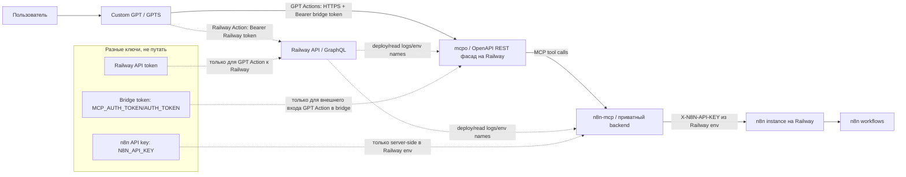

# ChatGPT как пульт-управления

Короткая операционная инструкция к уроку: как из Custom GPT сделать пульт управления внешними сервисами на примере n8n через GPT Actions, Railway, `mcpo` и `n8n-mcp`.

> Статус: черновик runbook на основе транскрипции и runtime-проверок.  
> Главная цель: не пересказать урок, а зафиксировать порядок настройки, схему авторизации и места, где нельзя перепутать ключи.

## 1. Идея урока

ChatGPT сам по себе уже может быть пультом управления сервисами, если у сервиса есть API или готовый коннектор. Для сервисов без готового ChatGPT-коннектора можно использовать **Custom GPT + Actions**.

В этом уроке целевой сервис — **n8n**.  
Задача: дать Custom GPT возможность читать, валидировать и безопасно редактировать n8n workflows.

## 2. Рабочая архитектура



Файл со схемой отдельно: [`assets/architecture.mmd`](./assets/architecture.mmd).

## 3. Компоненты

| Компонент | Где живёт | Зачем нужен |
|---|---|---|
| Custom GPT / GPTS | ChatGPT | Интерфейс пользователя, инструкции, GPT Actions |
| GPT Actions | В настройках Custom GPT | HTTP-вызовы во внешние сервисы по OpenAPI schema |
| Railway Action | В Custom GPT | Дать GPT возможность управлять Railway через API/GraphQL |
| Railway | Отдельный хостинг сервисов | Поднять bridge, `mcpo`, `n8n-mcp`, смотреть логи и env |
| `mcpo` | Railway service | Публичный OpenAPI/REST фасад поверх MCP |
| `n8n-mcp` | Railway service / backend | MCP-сервер, который умеет работать с n8n |
| n8n | Railway или другой хостинг | Целевой automation-сервис и workflows |

## 4. Ключи и авторизация: не путать

В уроке опасное место — слово “API key”. На самом деле есть разные ключи.

### 4.1 Railway API token

**Назначение:** дать Custom GPT доступ к Railway API.

- Где взять: Railway → Account Settings → Tokens.
- Куда вставить: в GPT Action для Railway.
- Auth type: API key / Bearer.
- Для чего: создавать проекты, сервисы, читать logs/env/deployments.
- Не является: не n8n API key и не bridge token.

### 4.2 Bridge token

**Назначение:** защитить публичный endpoint, чтобы посторонний человек не вызвал bridge с улицы.

- Где хранить: Railway variables у публичного bridge/`mcpo`/`n8n-control-mcp` сервиса.
- Возможные имена переменных:
  - `MCP_AUTH_TOKEN`
  - `AUTH_TOKEN`
  - `OPERATOR_API_KEY`
  - `OPERATOR_API_KEYS`
- Куда вставить: в GPT Action, который вызывает bridge.
- Обычно используется как: `Authorization: Bearer <bridge_token>`.

### 4.3 n8n API key

**Назначение:** дать backend-сервису право обращаться к n8n API.

- Где взять: n8n UI → Settings → n8n API → Create API Key.
- Где хранить: Railway variables backend-сервиса.
- Имя переменной: `N8N_API_KEY`.
- Как используется: только server-side.
- HTTP header к n8n: `X-N8N-API-KEY`.

**Жёсткое правило:**

```text
N8N_API_KEY нельзя вставлять в GPT Actions.
GPT Action получает только bridge token.
N8N_API_KEY остаётся внутри Railway env у backend-сервиса.
```

## 5. Порядок настройки с нуля

### Шаг 1. Создать Custom GPT

1. Открыть ChatGPT → Explore GPTs / My GPTs.
2. Нажать Create.
3. Дать имя, например: `n8n MCP оператор`.
4. Добавить краткую инструкцию: GPT должен работать как оператор n8n, сначала читать и валидировать, а изменения делать только после подтверждения.

### Шаг 2. Добавить Railway Action

1. В GPT → Configure → Actions → Create new action.
2. Вставить OpenAPI schema для Railway GraphQL Action.
3. Выбрать auth type: API key / Bearer.
4. Вставить Railway API token.
5. Сделать read-only smoke test: попросить GPT прочитать проекты/сервисы Railway.

### Шаг 3. Поднять bridge на Railway

Целевая идея:

```text
Railway project
  ├─ service: n8n-mcp
  └─ service: mcpo / public OpenAPI facade
```

`n8n-mcp` работает как приватный backend, который знает `N8N_API_KEY`.  
`mcpo` работает как публичный HTTP/OpenAPI фасад, который защищён bridge token.

### Шаг 4. Настроить Railway variables

Минимальный набор переменных:

```env
N8N_API_URL=https://<your-n8n-domain>
N8N_API_KEY=<masked>
MCP_MODE=http
MCP_AUTH_TOKEN=<masked>
AUTH_TOKEN=<masked>
NODE_ENV=production
```

Значения секретов не коммитить и не вставлять в учебные материалы.

### Шаг 5. Сгенерировать OpenAPI schema для GPT Action

1. Получить OpenAPI endpoints от `mcpo`.
2. Вставить schema в GPT Action.
3. В Action auth указать bridge token, а не `N8N_API_KEY`.
4. Проверить endpoints в UI Actions.

### Шаг 6. Smoke test

Безопасный первый тест:

```text
Покажи список n8n workflows.
```

Ожидаемый результат: GPT вызывает bridge, bridge вызывает n8n-mcp, n8n-mcp получает список workflows из n8n.

## 6. Порядок безопасной работы с n8n workflows

1. Сначала read-only:
   - list workflows;
   - get workflow;
   - validate workflow;
   - explain warnings.
2. Затем propose patch:
   - GPT предлагает изменения;
   - показывает риски;
   - показывает rollback.
3. Только после подтверждения:
   - apply patch;
   - validate;
   - readback;
   - smoke test.
4. Нельзя писать `DONE`, пока нет:
   - evidence;
   - validator PASS;
   - readback;
   - smoke/test;
   - rollback или `rollback_not_required`.

## 7. Known issues и recovery

### 7.1 `Session terminated`

Не считать это сразу поломкой n8n.

Порядок диагностики:

1. Проверить health bridge.
2. Проверить, что Railway service не перезапускается.
3. Проверить `authTokenConfigured=true`.
4. Проверить target n8n API connection.
5. Проверить, не истёк ли внешний bridge token.
6. Не делать повторную mutation без readback.

### 7.2 Ошибки авторизации

Проверить, какой именно ключ используется:

| Ошибка | Вероятная причина |
|---|---|
| GPT Action получает 401 | Неверный bridge token в GPT Action |
| Bridge не может читать workflows | Неверный или отсутствующий `N8N_API_KEY` |
| GPT не видит Railway | Неверный Railway API token |
| Внешний endpoint доступен без auth | Не настроен `MCP_AUTH_TOKEN` / `AUTH_TOKEN` |

## 8. Что не выкладывать в репозиторий

- Значения `N8N_API_KEY`.
- Значения Railway API token.
- Значения `MCP_AUTH_TOKEN`, `AUTH_TOKEN`, `OPERATOR_API_KEY`.
- Полные логи с секретами.
- Screenshots, где видны ключи.
- Production webhook URLs, если они не должны быть публичными.

## 9. Что ещё нужно подтвердить в реальной внутрянке

Эти пункты нельзя выдумывать из транскрипции:

```yaml
Railway:
  project_name: NEEDS_DISCOVERY
  service_n8n_mcp_name: NEEDS_DISCOVERY
  service_mcpo_name: NEEDS_DISCOVERY
  actual_start_command: NEEDS_DISCOVERY
  cpu_memory_limits: NEEDS_DISCOVERY
  deployment_source_repo: NEEDS_DISCOVERY

GPT Actions:
  railway_action_schema_file: NEEDS_FILE
  n8n_bridge_action_schema_file: NEEDS_FILE
  actual_auth_header_name: NEEDS_DISCOVERY

n8n:
  target_instance_url: CONFIRMED_IN_RUNTIME_BUT_MASK_FOR_PUBLIC_DOCS
  workflows_count_observed: 285
```

## 10. Мини-скрипт объяснения для урока

> Мы не подключаем ChatGPT напрямую к n8n API.  
> Мы делаем безопасную прокладку.  
> ChatGPT вызывает публичный bridge с отдельным Bearer token.  
> Bridge на Railway вызывает `n8n-mcp`.  
> А уже `n8n-mcp` ходит в n8n с внутренним `N8N_API_KEY`.  
> Поэтому n8n API key не попадает в GPT Actions и не раскрывается наружу.
