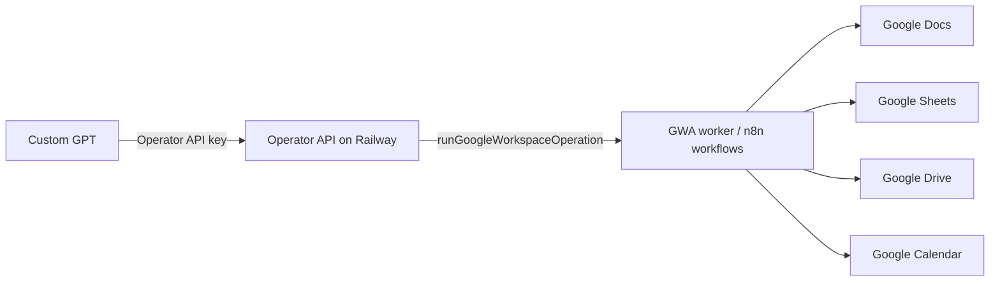

# Google Workspace Control

Purpose: Docs, Sheets, Drive, Calendar operations through the Operator API on Railway.

Main tool:
`runGoogleWorkspaceOperation`

Architecture:


Read-only examples:
- docs.read
- docs.readChunk
- sheets.read
- sheets.readRange
- drive.search
- calendar.availability
- calendar.events.getMany

Write-after-approval:
- docs.appendText / replaceText / writeBatch
- sheets.appendRow / updateRange
- calendar.events.create/update/delete
- drive.trash

Secrets:
Google OAuth/service credentials must stay in n8n credentials or Railway env, never in README/chat.

NEEDS_DISCOVERY:
```yaml
exact_railway_service_name: NEEDS_DISCOVERY
credential_location: NEEDS_DISCOVERY
default_test_doc_id: NEEDS_DISCOVERY
default_test_sheet_id: NEEDS_DISCOVERY
```
