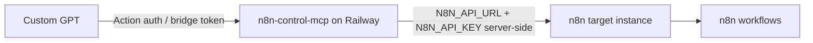

# n8n Control MCP

Purpose: control for reading, validating, and after approval editing n8n workflows.

Action schema in repo:
`ChatGPT как пульт-управления/gpts-action-n8n-control-mcp.json`

Architecture:


Railway variables:
```env
N8N_API_URL=https://<target-n8n>
N8N_API_KEY=<masked>
MCP_MODE=http
AUTH_TOKEN=<bridge_or_control_token>
```

Rule:
`N8N_API_KEY` must never be inserted into GPT Actions. It lives only server-side in Railway env.

Modes:
- read_only: list/get/validate/explain workflows
- propose_patch: diff + risks + rollback
- write_after_approval: apply + validate + readback + smoke
- dangerous_approval: credentials/env/secrets/deploy/delete/disable production

Runtime evidence:
```yaml
previous:
  platform: Railway
  MCP_MODE: http
  authTokenConfigured: true
  target_n8n_api_connected: true
  workflows_count_observed: 285
latest:
  health_check: Session terminated
  interpretation: transport/session issue, not proof that n8n is down
```
