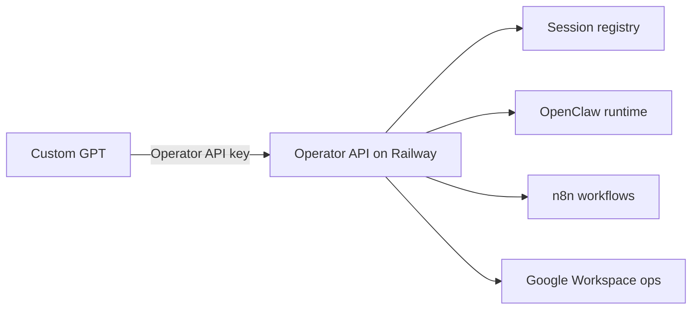

# OpenClaw Operator Control

Purpose: persistent operator sessions, OpenClaw handoff, project workflow turns.

Runtime endpoint:
`primary-production-0889.up.railway.app`

Tools:
- getOpenClawOperatorStatus
- listOpenClawSessions
- createOpenClawSession
- selectOpenClawSession
- sendMessageToOpenClaw
- compactOpenClawSession
- resetOpenClawSession
- getOpenClawJobStatus
- processProjectWorkflowTurn
- runGoogleWorkspaceOperation

Architecture:


Runtime evidence:
```yaml
statusCode: 200
status: ok
n8n: ok
transport_ok: true
semantic_advisor_verdict: PASS
```

Rules:
- status first
- list/create session before select
- never use default as session_key
- no secrets in messages
- no compact/reset without explicit request
- no DONE without evidence_refs/proof/trace_id
