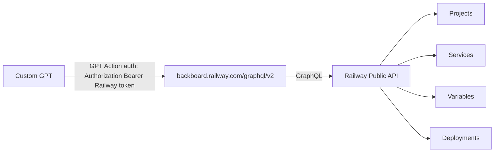

# Railway GraphQL Control

Purpose: first control a human adds to Custom GPT. It lets GPT read and, after approval, manage Railway projects/services/domains/variables/deployments.

Action schema in repo:
`ChatGPT как пульт-управления/gpts-action-backboard_railway.yaml`

Architecture:


Keys:
- Railway Account/Workspace API token: created in Railway Account Settings → Tokens, inserted into GPT Action auth as Bearer.
- Service variables/secrets: stored only in Railway service Variables.

Read-only:
- list projects/services/domains
- read deployment status
- read variable names, not values
- inspect logs without secrets

Approval required:
- create/update/delete variables
- deploy/redeploy/restart
- create/delete services/projects
- domain changes
- token rotation

Runtime evidence:
```yaml
railway_graphql: Not Authorized
safe_conclusion: schema exists, but runtime token/scope/workspace must be fixed or checked
```

NEEDS_DISCOVERY:
```yaml
project_name: NEEDS_DISCOVERY
environment_name: NEEDS_DISCOVERY
service_names: NEEDS_DISCOVERY
exact_start_commands: NEEDS_DISCOVERY
exact_variable_names_per_service: NEEDS_DISCOVERY
```
