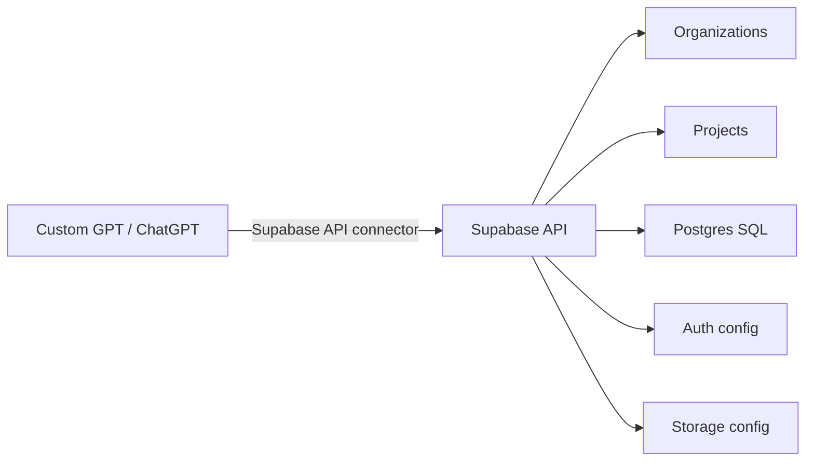

# Supabase Native Control

Purpose: Supabase is documented as a contrast example: it can be connected through native/API connector, not necessarily through Railway MCP bridge.

Architecture:

Read-only:
- profile
- list organizations/projects
- get project
- health
- read-only SQL
- logs
- list migrations
- list secrets/API keys without values

Approval required:
- create/delete project
- run SQL
- migrations apply/rollback
- upsert/delete secrets
- auth/storage config update
- pause/restore project

Rule:
Supabase access token and DB password are secrets and must not be printed.
